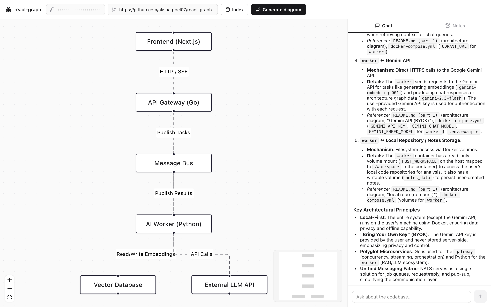

# react-graph

A **local-first repo comprehension tool**. Point it at a repository on your
machine and it builds an interactive architecture graph, lets you **talk to the
codebase**, and helps you accumulate **understanding & notes** — all running on
your own machine in Docker.

> The **only external dependency is the Gemini API**, and you bring your own key
> (BYOK). The key travels per-request from the browser and is **never persisted**
> server-side. Everything else — orchestration, messaging, vectors — runs in
> local containers.

This is a ground-up rewrite of the original GitHub-coupled prototype. GitHub is
gone: source comes straight from the local filesystem.



<sub>Above: react-graph pointed at its own public repo — the generated architecture diagram (left) and a grounded chat answer (right).</sub>

---

## Architecture

```
┌──────────────┐   HTTP + SSE    ┌─────────────────┐     NATS      ┌────────────────────┐
│  frontend    │ ──────────────► │   gateway (Go)  │ ────────────► │   worker (Python)  │
│  Next.js/TS  │ ◄────────────── │  orchestration  │ ◄──progress── │   RAG + Gemini     │
└──────────────┘                 └────────┬────────┘   events      └─────────┬──────────┘
                                          │                                  │
                                   request/reply + job queue                 ├─► Qdrant (vectors)
                                       (NATS / JetStream)                     ├─► local repo (ro mount)
                                                                              └─► Gemini API (BYOK)
```

| Service    | Language        | Responsibility |
|------------|-----------------|----------------|
| `frontend` | Next.js + TypeScript | UI: repo picker, architecture graph (React Flow), chat, notes. |
| `gateway`  | Go              | The only service the browser talks to. Terminates HTTP/SSE, carries the BYOK Gemini key per request, validates input, enqueues jobs and streams progress/results over NATS. No Gemini SDK — pure orchestration. |
| `worker`   | Python          | Where the AI lives: filesystem source reader, code chunking, Gemini embeddings, Qdrant upsert/search, Gemini chat + graph generation. |
| `qdrant`   | (image)         | Vector database for code embeddings. |
| `nats`     | (image)         | Messaging fabric: job queue **and** request/reply **and** progress pub-sub. |

### Why these choices (2026)

- **Go for the gateway, Python for the AI.** The gateway's job is concurrency,
  streaming and orchestration — Go's strengths. The RAG/LLM ecosystem lives in
  Python, so that's where embeddings, chunking and Gemini calls go. Go never
  touches the Gemini SDK.
- **NATS as a single fabric** (queue + RPC + pub-sub) avoids running both a
  message queue and a separate gRPC stack. Indexing is a long-running job with
  live progress — a natural fit.
- **Qdrant** over pgvector: purpose-built vector search, one-line Docker, native
  payload filtering, and no SQL schema to maintain for a local tool.
- **Gemini, BYOK, only external dep.** Embeddings: `gemini-embedding-001` (GA,
  3072-dim). Chat/graph: `gemini-2.5-flash` (1M context) by default — note
  `gemini-2.0-flash` is **deprecated as of 2026-06-01**. Both configurable via
  `.env`.

---

## Running it

Prerequisites: Docker + Docker Compose, and a Gemini API key
(<https://aistudio.google.com/apikey>).

```bash
cp .env.example .env
# (optional) put a dev-fallback key in .env; otherwise enter it in the UI

# Put the repo(s) you want to analyze where the worker can read them:
#   HOST_WORKSPACE in .env points at a folder of checkouts (default ./workspace)
git clone <some-repo> ./workspace/some-repo

docker compose up --build
```

Then open:

- Frontend: <http://localhost:3000> (if 3000 is taken, set `FRONTEND_PORT` in
  `.env`, e.g. `FRONTEND_PORT=3100`)
- Gateway health: <http://localhost:8080/health>
- Qdrant dashboard: <http://localhost:6333/dashboard>
- NATS monitoring: <http://localhost:8222>

### Using it

1. Paste your Gemini key (kept only in your browser, sent per request).
2. Either set the **path** to a repo already under `./workspace`, **or** paste a
   **public GitHub URL** to have it cloned and indexed automatically.
3. **Index repo** — watch progress stream as files are chunked + embedded.
4. **Generate diagram** — an architecture graph rendered with React Flow.
5. **Talk to the repo** — ask questions; answers are grounded in retrieved code.
6. **Notes** — record what you learn; notes feed back into chat as context.

---

## Phase roadmap

Built and pushed to `main` incrementally so progress is visible.

- [x] **Phase 1 — Scaffold & orchestration.** Teardown of the old app; polyglot
      monorepo; `docker compose up` brings up frontend + gateway + worker +
      Qdrant + NATS; frontend reports gateway health.
- [x] **Phase 2 — Gateway.** chi router, BYOK key middleware, NATS connection
      (reconnecting), SSE streaming, and the full route surface:
      `POST /api/index` (streams progress), `POST /api/graph`,
      `POST /api/chat`, `/api/notes`. Endpoints degrade gracefully until the
      worker handlers land (clear 503 / timeout messages).
- [x] **Phase 3 — Worker core.** Async NATS subscriber (queue group), local
      filesystem source adapter (sandboxed to the workspace, ignores binaries /
      generated dirs), and a code chunker. Indexing now walks + chunks a repo
      and streams live progress to the UI end-to-end (embeddings/storage in P4).
- [x] **Phase 4 — Indexing.** `gemini-embedding-001` embeddings (batched,
      BYOK) → per-project Qdrant collection, progress streamed live. The index
      endpoint is now a single race-free SSE `POST` (gateway subscribes before
      publishing). Verified end-to-end: a sample repo embeds and lands in Qdrant
      (dim 3072, status green).
- [x] **Phase 5 — Graph.** Worker detects the stack + file layout and prompts
      `gemini-2.5-flash` for React Flow JSON (request/reply over NATS). New
      TypeScript frontend: BYOK key field (localStorage), project/path inputs,
      an Index button that streams progress, and a Generate-diagram button that
      renders the graph with `@xyflow/react`. Verified end-to-end.
- [x] **Phase 6 — Chat/RAG.** Worker embeds the question, retrieves top-k
      chunks from Qdrant, and streams a grounded `gemini-2.5-flash` answer
      (NATS → gateway SSE → UI). Frontend chat panel renders tokens live.
      Verified: answers cite the actual indexed files.
- [x] **Phase 7 — Notes & polish.** Per-project notes persisted to a writable
      volume (CRUD via `/api/notes`), surfaced in a UI panel, and folded into the
      chat prompt so understanding compounds. Verified add/list/delete + chat
      context.
- [x] **Phase 8 — Index a public GitHub URL.** Paste a public repo URL; the
      worker shallow-clones it into the workspace (git over HTTPS, no token →
      doesn't reintroduce GitHub auth) and indexes it in one streamed action.
      Verified by cloning + indexing `octocat/Hello-World`.
- [x] **Phase 9 — Heptabase-inspired redesign.** Minimal monochrome (paper-white,
      CSS-variable theme), slim top bar with a unified repo field (local path
      *or* GitHub URL), **graph canvas on the left, Chat/Notes tabs on the
      right**. lucide icons, markdown-rendered answers, a streaming caret, and
      React Flow nodes styled as Heptabase-like cards.

## Repository layout

```
react-graph/
├── docker-compose.yml      # the whole local system
├── .env.example            # config (Gemini key, models, paths)
├── frontend/               # Next.js + TypeScript
├── gateway/                # Go orchestration tier
├── worker/                 # Python AI/RAG tier
└── workspace/              # mount point for repos to analyze (git-ignored)
```
